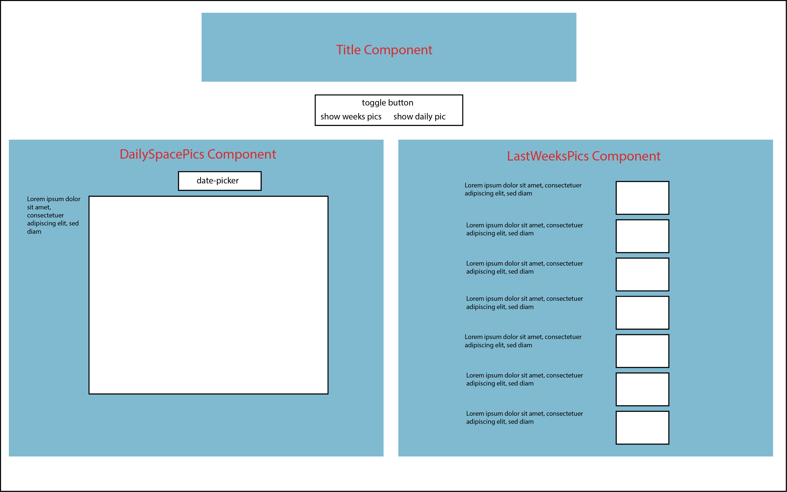

# Coding Challenge

This app fetches and displays data from the NASA API.

## My goal

The app should:

- fetch and display the Astronomy picture of the day
- fetch and display the picture of the day for a certain date, the user chooses with via date-picker
- fetch and display a list of seven pictures, starting today, going backwards and being displayed as last weeks pictures of the day

I started out by sketching this wireframe:



## Prerequisites

- [Node.js](https://nodejs.org) version 12 or newer.
- [yarn](https://yarnpkg.com/) package manager. Version 1.21.0 or newer.

## Installation

1. Clone or download the repository from the command line

```
git clone git@github.com:bitcrowd/coding_challenge_lilli.git

```
2. Go to the local directory

```
cd coding_challenge_lilli
```
3. Install the project dependencies

```
yarn install
```
4. Run development mode

```
yarn start
```

## Testing
I use
- React testing library - for testing React components.
- React test renderer - Enables snapshot tests.
```
yarn run test
```
## Linting

I use [eslint](https://eslint.org/).
## Code formatter

I use [prettier](https://prettier.io/) to format the code. It is recommended to use VSCode text editor with [prettier-vscode extension](https://marketplace.visualstudio.com/items?itemName=esbenp.prettier-vscode).
## Styling

I use [styled-components](https://styled-components.com/).

## Other third party libraries
I use [react date-picker](https://github.com/wojtekmaj/react-date-picker)

React-Calendar, on which React-Date-Picker relies heavily, uses modern web technologies. That's why it's so fast, lightweight and easy to style. This, however, comes at a cost of supporting only modern browsers.
If you need to support legacy browsers like Internet Explorer 10, you will need to use Intl.js or another Intl polyfill along with React-Date-Picker.

## Commit messages convention

I use semantic commit messages like this [gist example](https://gist.github.com/joshbuchea/6f47e86d2510bce28f8e7f42ae84c716).

## Roadmap

My future improvements would be:

- improve test coverage.
- add routing and display more components with NASA data.
- move date-picker into the DailySpacePics component.

## My decisions

- I use fetch, inbuilt JavaScript method, for the API calls.
- I use styled components for better structured and therefore better readable css.
- I use the react-date-picker since it's very light-weight and convenient given the time-constraint. But the missing support for legacy browser is a downside and not acceptable for many real-life projects.
